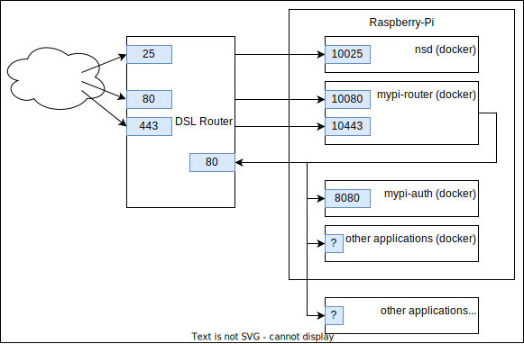
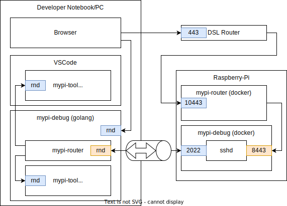

# MyPi-Tools


[](https://codecov.io/gh/dueckminor/mypi-tools)
[](https://goreportcard.com/report/github.com/dueckminor/mypi-tools)

## Tools

### mypi-setup

Runs on your PC/Notebook and creates an SD-Card for a automated installation
of Alpine-Linux on a Raspberry-PI. It's not necessary to connect a keyboard
or display to your Raspberry-PI. All you need is a network cable and a power
supply.

When you start `mypi-setup` a browser window will open. Just follow the
instructions and you will get a SD-Card ready for your Raspberry-PI. After
you have inserted this SD-Card to your Raspberry-PI, `mypi-setup` will connect
to it and completes the installation.

### mypi-control

Runs on your Raspberry-PI and

- completes the installation
  - makes the image bootable from disk (this requires less memory)
  - install basic packages like
    - `docker`
    - `bash`
    - `jq`
- provides a management Web-UI

### mypi-auth

The user authentication service. Provides a Login-UI.

### mypi-router

All requests from the internet are routed to the applications by the
`mypi-router`. Plain HTTP requests will just be redirected to HTTPS, the only
exception are lets-encrypt challenges.

To decide, how HTTPS connections shall be routed, the `mypi-router` parses,
the first TLS packet and extracts the SNI extension. If the SNI extension is
missing, or the requested server-name is unknown, the `mypi-router` will just
close the connection. This filters out most unwanted traffic without giving
potential attackers to much information.

For known server-names, the `mypi-router` supports different routing methods:

- forward to application directly (the application has to perform
  the TLS handshake itself)
- terminate the TLS connection and forward the HTTP content to the application
  - without modifying the headers
  - with an additional layer of authentication (using `mypi-auth`)
  - use HTTPS to connect to the application



### mypi-videostream

Allows to access web-cams

### mypi-owntracks

Reacts on owntracks events. It opens my gate when I come home.

## Dev-Environment

To allow debugging of the GoLang and Web Applications you could use do the
following:

```bash
ssh mypi
mypi service mypi-debug start
```

This starts a docker container with an `sshd` to allow port forwarding back
to the developer notebook/pc.

```bash
./scripts/debug
```

This starts the mypi-debug application which

- provides a web UI allowing to start/stop the different tools
- establishes an SSH-tunnel to the docker container
- uses the mypi-router code to forward requests to the correct tool


